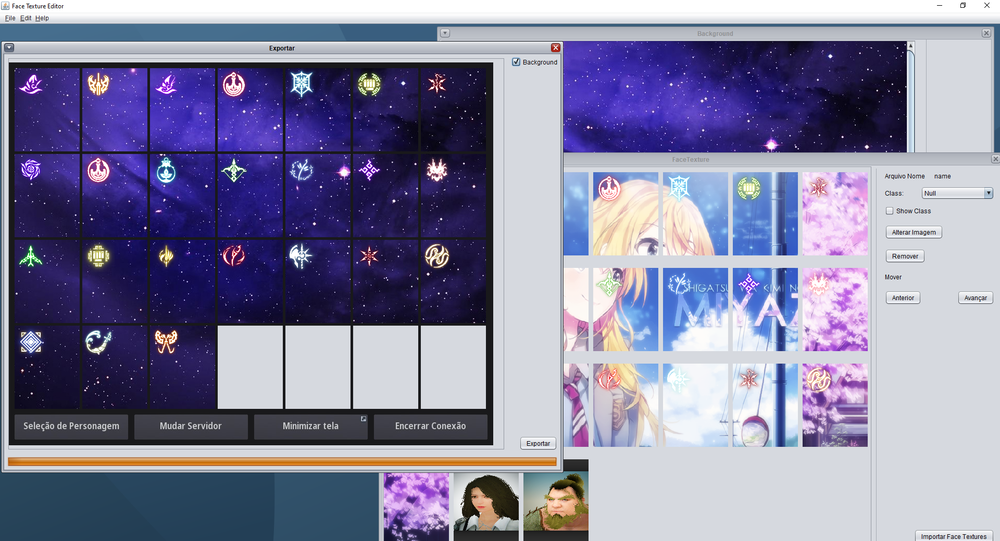

# FaceTextureEditor

> Projeto Java para manipulação das face texture do jogo Black Desert Online.

### Ajustes e melhorias

O projeto ainda está em desenvolvimento e as próximas atualizações serão voltadas nas seguintes tarefas:

- [ ] Inclusão do assistente inicial
- [ ] Melhoramentos na tela Ajuda

## 💻 Pré-requisitos

Antes de começar, verifique se você atendeu aos seguintes requisitos:
* Você instalou a versão mais recente de `<Java >`
* Você tem uma máquina `<Windows>`.

[⬆ Voltar ao topo](#nome-do-projeto) 
